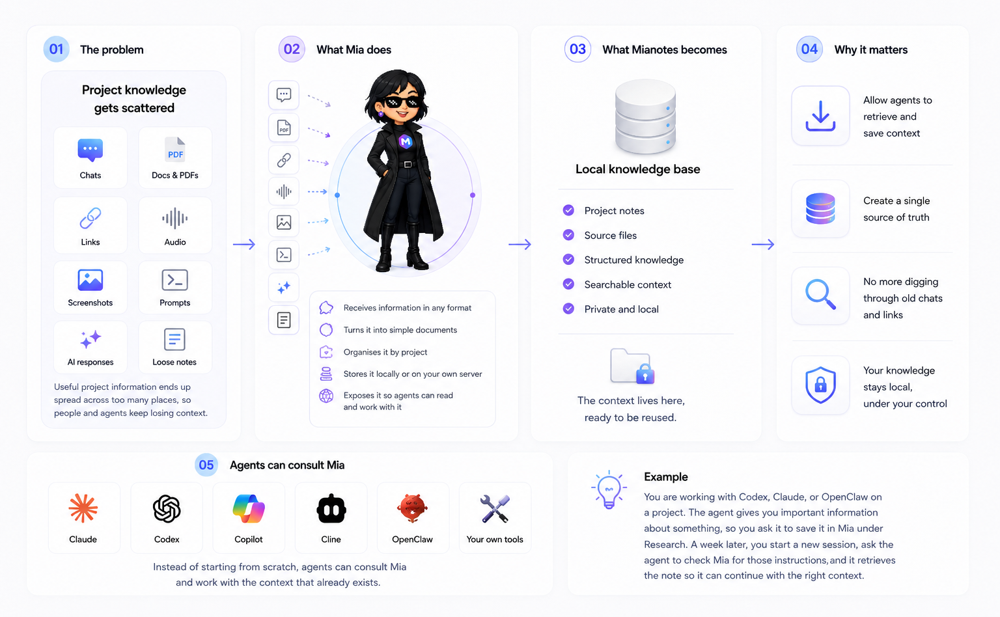

# Mianotes web service

Mianotes Web Service is the Python backend for Mianotes, a local-first knowledge repository for humans and AI agents. It turns documents, images, links, audio, and text into organised Markdown notes that can be searched, shared, improved by Mia, and managed programmatically by other agents.

The service is designed for small groups of people: small teams, families, developers, researchers, and students who want durable knowledge stored in plain files that agents and tools can use directly. Because Mianotes uses the filesystem as its main storage layer, anyone can install as many instances as they want. 

## What it does

- Stores note text as Markdown on the filesystem.
- Keeps users, projects, notes, tags, comments, jobs, sessions, and API tokens indexed in SQLite.
- Converts uploaded files and URLs through a MarkItDown-based parser layer.
- Supports browser sessions and scoped API tokens for agents.
- Exposes JSON REST APIs for the web app and external automation.
- Provides a stdio MCP server so compatible AI agents can use Mianotes as a local knowledge tool.
- Supports local LLMs, or OpenAI, for Mia-powered note operations.

## Documentation

- [Introduction](docs/01-Introduction.md)
- [Installation](docs/02-Installation.md)
- [Workflow](docs/03-Workflow.md)
- [APIs](docs/04-API.md)
- [Customisation](docs/05-Customisation.md)
- [Mia and agents](docs/06-Mia-And-Agents.md)
- [MCP](docs/07-MCP.md)
- [Architecture](docs/08-Architecture.md)
- [Development](docs/09-Development.md)
- [Testing](docs/10-Testing.md)

## Technology

- FastAPI
- Pydantic
- SQLAlchemy
- Alembic
- SQLite
- MarkItDown
- Local LLMs, or OpenAI
- pytest
- Ruff

## License

Mianotes Web Service is licensed under GPL-3.0. See [LICENCE](LICENCE).
